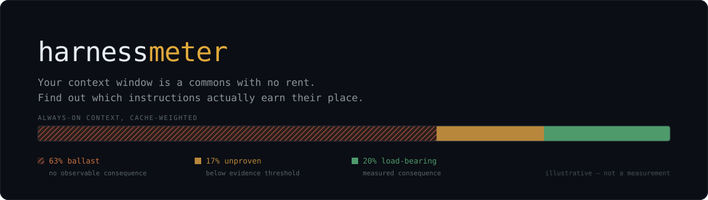
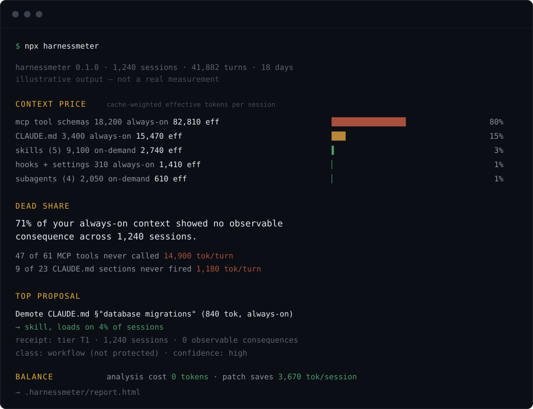
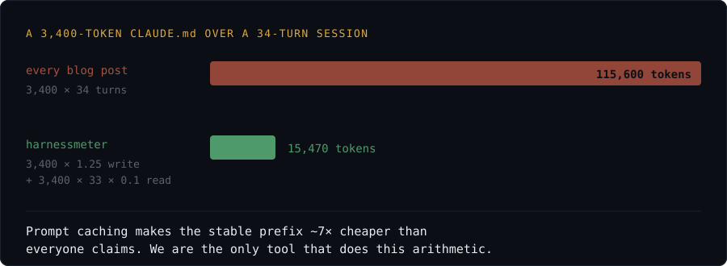
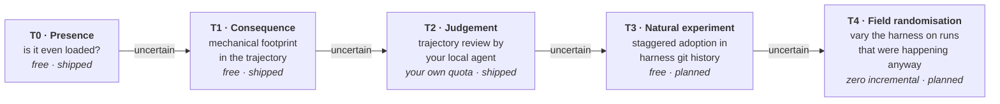

<p align="center">
  
</p>

<p align="center">
  <a href="https://github.com/alebgl77/harnessmeter/actions/workflows/ci.yml"></a>
  
  
  
  
  
</p>

---

You have 4,000 lines of `CLAUDE.md`, twelve subagents, eight MCP servers, and **zero tests**.
Someone edits one line and the behaviour of your whole team shifts, silently.

We have profilers for CPU, memory, SQL, and JS bundles. We have **none for context** — the
scarcest resource in agentic engineering. Every token of your harness is loaded on *every
turn*, of *every session*, of *every developer*. Nobody can tell you which lines pay for
themselves.

`harnessmeter` prices them.

## The frame

**Your context window is a commons with no rent.** Every instruction occupies space for
free, forever, regardless of what it produces. Two things follow, and you've felt both:

- `CLAUDE.md` only ever grows.
- At 4,000 lines, nobody dares delete anything, because nobody can prove what's load-bearing.

So we give every block a **lease**: a measured price, a measured yield, and a renewal that
has to be earned.

## Run it

```sh
npx harnessmeter          # this project
npx harnessmeter --all    # every project on this machine
npx harnessmeter --t2     # escalate the unproven claims (see below)
```

Requires Node ≥ 22.18 — the source is TypeScript and Node runs it directly, so there is no
build step and **no dependencies at all**. It reads `~/.claude/projects/**/*.jsonl` and
your harness files, writes `.harnessmeter/report.html`, and touches nothing else.

## What it shows

<p align="center">
  
</p>

<p align="center"><sub>Illustrative output. Not a real measurement.</sub></p>

## The arithmetic everyone gets wrong

Every "your CLAUDE.md costs you $X" post multiplies tokens by turns. That ignores prompt
caching, and it is wrong by roughly **7×**.

<p align="center">
  
</p>

A stable prefix is billed as one write at `1.25×` and then reads at `0.1×`. Getting this
right is the whole point: an instrument that inflates its own findings is not an instrument.

It also moves the headline metric off dollars. The dominant cost of a bloated harness is
**attention dilution and window consumed**, not the invoice. So harnessmeter reports
**context share** and **dead share** first, and money second.

And it surfaces results you would not have guessed:

- A 200-token always-on rule can cost more than a 3,000-token skill that loads 2% of the
  time. Residency beats size.
- A skill's real always-on tax is its **frontmatter description**, not its body — the body
  only loads on use. Pricing the whole file overstates it by an order of magnitude.
- On the setups measured so far, `CLAUDE.md` is a **minority** of the always-on prefix.
  MCP tool schemas dominate it. The file everyone argues about is rarely the expensive one.

## How it measures

"Is this line load-bearing?" is not directly observable. So evidence is **tiered**, and the
tier reached is always printed next to the claim. Measurement budget is spent only where
the decision is actually uncertain.



### T2, and what it costs

T0 and T1 are free but blunt: they can only rule on claims with a mechanically observable
footprint. Everything else comes back `unproven` — honest, but not useful. `--t2` escalates
exactly those, and only those.

It shells out to the agent CLI you already have (`claude`, `codex`) and spends **your own
quota** — harnessmeter never holds an API key. It sends the claim text plus a **shape-only
digest** of sampled sessions: turn counts and tool-call tallies. No message content, no file
contents, no paths. You are asked to confirm before anything is sent.

That bound is deliberate, and it bounds what T2 may claim: a rule about tone or wording
cannot be judged from a tool trajectory, so it returns **`unjudgeable`** rather than a
guess. A wrong "complied" is worse than an honest "I can't tell".

Calls are batched hard — one call judging twelve claims, never twelve calls. On a loaded
setup a single headless invocation costs about **$0.11 before it does anything**, because it
pays the full always-on prefix. That measurement is itself an argument for the tool.

T2 distinguishes two failures that look alike and are not: a rule **nothing needed** wants
demoting; a rule **the agent ignored** wants rewriting. The report never conflates them.

The balance line reports what the run cost and how long it takes to pay for itself, so the
"net-negative by construction" claim can be audited rather than believed.

Two more design notes worth stating plainly:

**History is the control arm.** Classical ablation pays for both arms. But the "with the
rule" arm already exists — it's in your session transcripts. We only pay for the
counterfactual. Half the cost, and perfect pairing, because it is literally the same task.

**Your `git log` is an experiment log.** Different repos adopt the same piece of advice at
different dates. That is exactly the setting where staggered difference-in-differences
identifies an effect. Nobody has read `.claude/` history as an intervention registry.

## What it proposes

The primary action is **not deletion — it's demotion.**

> These 3,200 tokens are always-on and apply to 4% of your sessions.
> Here is the PR that turns them into a skill.

Massive win, near-zero risk, mergeable in thirty seconds. Deletion is the rare case.

Every proposal ships with a **receipt**: cost, measured yield, evidence tier, confidence
interval, the sessions that justify it, and the estimated risk of removal. A market you
can't audit will never survive code review.

## Prevention rules are protected

**A prevention rule has inverted yield: it looks useless precisely because it works.**
"Never commit a secret" will show a near-zero firing rate. A tool that proposes evicting it
deserves to be torn apart.

So claims carry a class. `prevention` claims are **protected by default**, excluded from
eviction on observational yield, and testable only by explicit adversarial probing. This is
a structural guarantee, not a promise.

## Principles

| | |
|---|---|
| **Net-negative by construction** | A cost profiler that costs money to run is incoherent. It prints its own balance. |
| **Zero API keys** | harnessmeter never authenticates to a model provider. Judgement work is delegated to the agent CLI you already have. |
| **Stack-agnostic by consequence** | Because it only ever talks to your local agent, Claude Code / Codex / Antigravity are the same code path. |
| **Local by default** | Reads transcripts and config on disk. No network. Contributing aggregates is opt-in and numeric only — never prompt text, filenames, or repo identifiers. |
| **Never applies on its own** | It measures and emits a diff. A human merges. |

## Status

**Early, and honest about it.** The tool runs and produces a real report from real
transcripts. What ships today is:

- exact billed-token accounting, including the 5m/1h cache-write split
- measured always-on prefix, decomposed into harness files vs. residual
- claim extraction from `CLAUDE.md`, skills, subagents, MCP servers
- evidence tiers **T0** (presence), **T1** (consequence) and **T2** (judgement via your own agent)
- lease ledger, dead share, demotion proposals with receipts, terminal + HTML report
- a balance line that reports what the run cost and when it pays for itself

Not yet: **T3** natural experiments over harness git history, **T4** field randomisation, and
the patch generator. Per-claim token counts are calibrated estimates at ~3.8 chars/token
and are labelled as estimates everywhere they appear; session-level figures are exact.

The measurement protocol for the higher tiers will be **pre-registered and published before
any results are**.

Issues and design critique very welcome — especially on the evidence model and on the
class inference, which is the part most likely to be wrong on someone else's harness.

## Project

| | |
|---|---|
| [CONTRIBUTING](CONTRIBUTING.md) | What is most wanted, house rules, how to run the tests |
| [Measurement dispute](https://github.com/alebgl77/harnessmeter/issues/new?template=measurement_dispute.yml) | The tool gave a verdict you believe is wrong — the most useful issue you can file |
| [SECURITY](SECURITY.md) | Exactly what it reads, writes and sends; how to report privately |
| [CHANGELOG](CHANGELOG.md) | What shipped, and the design decisions behind it |
| [Discussions](https://github.com/alebgl77/harnessmeter/discussions) | Arguments about how yield *should* be measured |

Development:

```sh
node --test "test/*.test.ts"   # no test framework — node:test
npx tsc --noEmit               # after: npm i --no-save typescript @types/node
```

CI runs the suite on Node 22.18 and 24 across Linux, macOS and Windows, **with no install
step** — if that job ever needs `npm install` to run the tests, the zero-dependency claim
has broken and the build should say so.

## License

MIT
