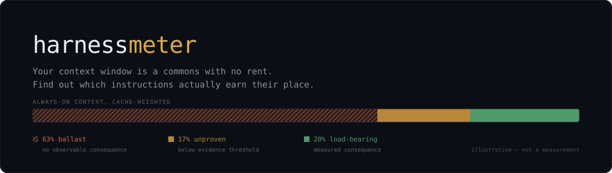
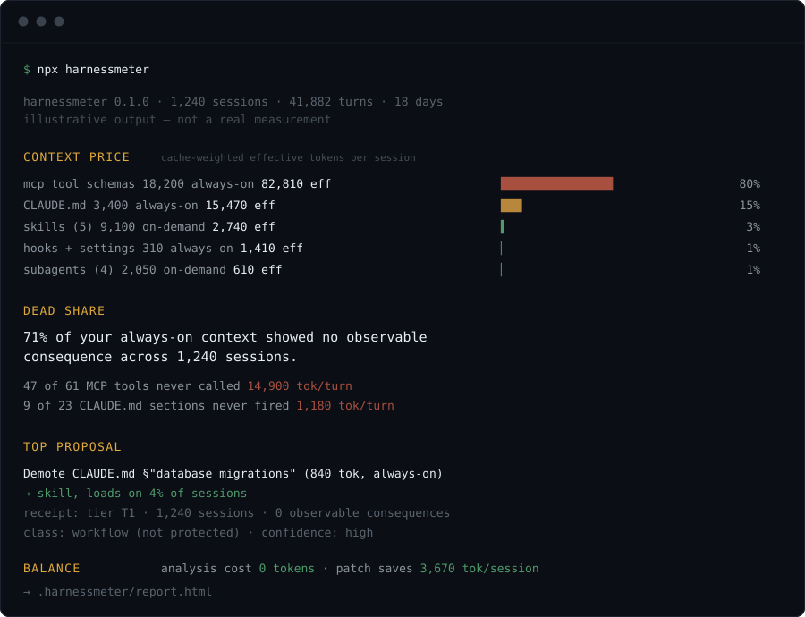

<p align="center">
  
</p>

<p align="center">
  <a href="https://www.npmjs.com/package/harnessmeter"></a>
  <a href="https://github.com/alebgl77/harnessmeter/actions/workflows/ci.yml"></a>
  
  
  
  
  
  
</p>

---

**Review the context your coding agents carry.** harnessmeter inventories instructions and
skills, estimates their resident footprint, and uses compatible local sessions to show
what evidence supports keeping or demoting a rule.

For experts and teams using Claude Code and Codex, it connects three decisions:

- **Onboard:** understand a repository's harness before any sessions exist.
- **Review:** compare instruction changes against a committed baseline and enforce token budgets.
- **Investigate:** inspect observed usage, evidence limits and reviewable Claude demotion proposals.

A smaller harness is not automatically a better harness. Token budgets constrain estimated
size; they do not prove task quality, compliance or savings.

## Run it

The provider, static-audit and baseline workflow below is **unreleased source-branch work**.
The published `0.3.0` package does not include these new flags. From this checkout, use
Node **22.18 or newer** and the source entry point:

```sh
node src/cli.ts --static --project-only                  # Claude inventory, no sessions
node src/cli.ts --provider codex --static --project-only # Codex inventory, no sessions
node src/cli.ts --provider claude                        # compatible local Claude sessions
node src/cli.ts --provider codex                         # compatible local Codex sessions
node src/cli.ts --help
```

To inspect another project, run `node /absolute/path/to/harnessmeter/src/cli.ts` from that
project's directory. There is no install or build step for source use, and no runtime
dependency. `bin/harnessmeter.js` prefers `dist/` when present; use `src/cli.ts` while
developing to avoid running an older build.

The released Claude workflow remains available with `npx harnessmeter` on Node **20 or
newer**. Publishing the new workflow requires a separately reviewed release; this change
does not bump or publish a version.

By default, a run writes `.harnessmeter/report.html`. `--json` prints JSON instead of
writing HTML; `--no-html` keeps terminal output only. T0/T1 read local files and make no
network or model calls. With no matching sessions, a run succeeds as an explicitly
labelled static audit: behavioral evidence and measured economics remain unavailable.

## Make instruction changes reviewable

From the repository being audited, using the source entry point described above:

```sh
node /absolute/path/to/harnessmeter/src/cli.ts --static --project-only --save-baseline harnessmeter.claude.json
node /absolute/path/to/harnessmeter/src/cli.ts --static --project-only --baseline harnessmeter.claude.json --max-tokens 8000 --max-growth 5
```

The limits here are examples, not recommended universal budgets. Choose them with your
team. Use a separate baseline with `--provider codex` for Codex; profiles are never added
together as if both agents loaded the same instructions.

The comparison shows added, removed and changed blocks with estimated token deltas. It
uses portable relative paths and hashes instead of instruction text or transcripts.
`--project-only` excludes personal configuration, including project-local MCP entries
stored in `~/.claude.json`, so those entries cannot affect a team baseline.

| Exit | Meaning |
|---|---|
| `0` | Analysis completed; any requested budgets passed |
| `1` | Invalid arguments, incompatible baseline or another error |
| `2` | At least one requested budget was exceeded; the report is still available |

`--max-tokens` accepts an integer ≥ 0. `--max-growth` accepts a percentage ≥ 0 and requires
`--baseline`. Reading and saving the same baseline path in one run is rejected.

See the [expert and team workflow](docs/expert-workflow.md) for onboarding, CI, JSON fields,
baseline review and provider coverage. A baseline is a footprint snapshot, **not a full
configuration or security audit**: MCP schema sizes are unknown and recorded as zero, and
configuration contents are not compared.

## Explore the report

<p align="center">
  
</p>

<p align="center"><sub>Synthetic illustration, not a real measurement or a screenshot of the current interface.</sub></p>

The self-contained HTML report provides search by label or source, kind and verdict
filters, token/name sorting, source file and line locations, and proposal receipts. Baseline
changes and budget results appear alongside the analysis. All claims remain available
without JavaScript; search, filters and sorting run locally in the browser.

Reports show measured subtotals when telemetry is incomplete. An unknown value is not
displayed as a free bill or proof that an instruction was unused. Reports and JSON can
expose local paths and harness structure: review them before sharing.

## What is measured

Per-claim token sizes are estimates at roughly **3.8 characters per token**. Skills contribute
their estimated frontmatter description to the resident inventory; their full body is
on-demand. The first-turn prompt, when available, is an **upper bound** on the resident
prefix because it also contains the opening user message. The unattributed remainder has
no measured decomposition.

Claude's supported usage records supply token counts and cache-write TTL buckets. The
pricing model uses `1.25×` for 5-minute writes, `2×` for 1-hour writes and `0.1×` for reads,
with per-session prefix-write counts derived from those records. Dollar figures are
**API-equivalent list-price estimates**, not subscription spend; unknown model rates are
disclosed. Multiplying resident tokens by turns, or assuming only one cache write per
session, loses this distinction.

Codex's supported cumulative usage records are differenced, with duplicate counters
ignored. **Codex dollar prices, cache-write TTLs and cache-based savings are unavailable**;
Claude's economics are never applied to them. Unsupported or incomplete records preserve
unknown states. See [coverage and limits](docs/expert-workflow.md#coverage-and-limits).

## Evidence before action

| Tier | Evidence | Availability |
|---|---|---|
| T0 | File inventory and presence attribution where the session format supports it | Local |
| T1 | Mechanically observable tool/command activity | Local; provider coverage matters |
| T2 | Judgement from claim text and a shape-only session digest | Claude profile, explicit opt-in |
| T3 | Natural experiment | Claim dating by git exists; causal inference is not implemented |
| T4 | Field randomisation | Planned |

Silence is not proof of uselessness. Verdicts carry the evidence tier and sample behind
them; applicable zero-observation claims carry a 95% upper bound. Claims are evaluated
against sessions in scope and dated from git history where possible, otherwise from file
modification time. Static audits produce no absence-based demotion proposals. Incomplete
Codex skill and code-mode attribution also prevents absence confidence and demotions.

### T2 uses your quota

For a measured Claude-profile audit, `--t2` asks a detected local agent CLI (`claude` or
`codex`) to judge eligible unproven claims. Choosing the CLI used for judgement is separate
from choosing the transcript provider. The Codex **profile** currently rejects `--t2`.

T2 sends claim text and sampled turn counts/tool-call tallies to that CLI and its model
provider. It does not send transcript message text, full source files or session paths as
separate context. Claim text can itself contain sensitive information or paths. The local
agent may also load its own configuration and context. Read the disclosure before
confirming; `--yes` explicitly skips confirmation. No API key is held by harnessmeter.

Claims requiring wording or tone evidence cannot be judged from that digest and return
`unjudgeable`. T2 cost and usage are reported when supplied by the CLI; missing figures and
the CLI's underlying network-call count remain unknown. See [SECURITY](SECURITY.md).

### Demote only after review

On a measured Claude-profile run, `--patch` writes candidate demotions as unified diffs in
`.harnessmeter/`. It never applies them. Project and user rules produce separate patches,
with the correct apply directory printed next to each. Codex rejects `--patch`, and
explicit `--static` rejects both `--patch` and `--t2`.

A proposed demotion moves an always-on section into a skill. **Review the generated skill
description:** it is the part the agent sees before deciding to load the body. The generated
heading and opening sentence are a draft, not proof that the new trigger preserves intent.
Review the diff, apply the printed `git -C <root> apply <patch>` command, and use
`git apply -R` from the same root to reverse it. Changed source sections, existing target
skills and unsafe paths are refused.

**Prevention rules are protected.** A rule such as “never commit a secret” can appear quiet
because it works. Claims classified as prevention are excluded from observational
demotion; classification is heuristic and should be disputed when wrong.

## Where it fits

Context profilers and instruction linters already exist. Direct comparators include
[ctxlint](https://github.com/tqakdev/ctxlint),
[agnix](https://github.com/agent-sh/agnix) and
[agenteval](https://github.com/lukasmetzler/agenteval). Adjacent tools include
[ccusage](https://ccusage.com/guide/) for local usage reporting,
[Promptfoo](https://www.promptfoo.dev/docs/integrations/ci-cd/) for evaluation gates and
[Langfuse](https://langfuse.com/docs/evaluation/overview) for traces and experiments.

harnessmeter focuses on the combination of local footprint review, conservative session
evidence, prevention protection and reviewable demotions. That is a product focus, not a
claim of universal superiority. The [comparison](docs/comparison.md) distinguishes
documented capabilities from untested hypotheses.

## Project

| | |
|---|---|
| [Expert workflow](docs/expert-workflow.md) | Onboarding, CI, JSON and coverage limits |
| [Comparison](docs/comparison.md) | Direct and adjacent tools, with primary sources |
| [CONTRIBUTING](CONTRIBUTING.md) | Measurement disputes, contribution priorities and checks |
| [Measurement dispute](https://github.com/alebgl77/harnessmeter/issues/new?template=measurement_dispute.yml) | Challenge a verdict without publishing private transcripts |
| [SECURITY](SECURITY.md) | Reads, writes, sharing and T2 disclosure |
| [CHANGELOG](CHANGELOG.md) | Released changes and unreleased work |

Development requires Node ≥ 22.18:

```sh
node src/cli.ts --static --project-only
node --test "test/*.test.ts"
npm ci                          # development tools and compiled build
npm run typecheck
npm run build                   # produces the publishable JavaScript
```

The tests and source CLI have no install requirement. CI covers Linux, macOS and Windows
on Node 22.18 and 24, plus compiled-package installation on Node 20 and 24. A source check
alone does not establish that a new release is ready; the built tarball must also pass.

## License

MIT
